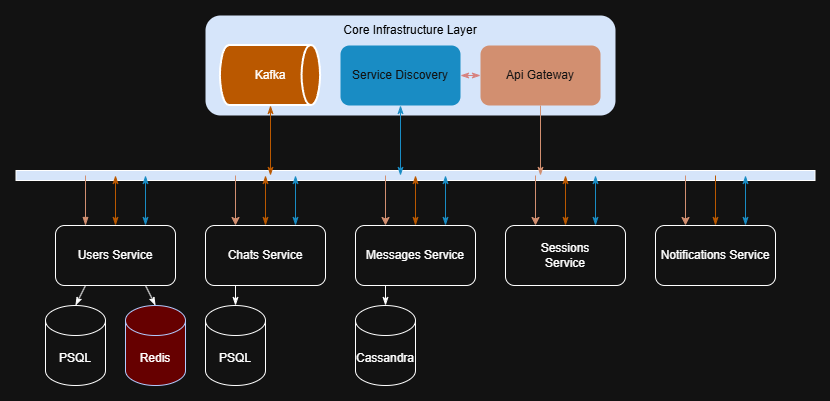

# ParanoiaX API

ParanoiaX is a highly secure, zero-knowledge, End-to-End Encrypted (E2EE) messaging backend. 

The core philosophy of ParanoiaX is absolute trustlessness in the server infrastructure. The server operates strictly as a "dumb pipe" for routing encrypted data and managing device states.

## System Architecture

The backend is built as a modular system (or microservices architecture), separating concerns like user management, message routing.

### Modules & Services

The backend is built as a distributed microservices architecture, communicating synchronously via API Gateway/Service Discovery and asynchronously via Kafka events.

* **[Users Service](./users/README.md)** — Core service handling invite-only registration, passwordless Challenge-Response authentication, device fleet management, and Cross-Signing attestation.
* **Chats Service** — Manages chat rooms, group metadata, and participant lists.
* **Messages Service** — Handles the routing of E2EE payloads, offline message queues, and delivery receipts.
* **Bots Service** — Integrates automated bots into the ecosystem, interacting directly with the Messages Service.
* **Sessions Service** — Manages persistent WebSocket connections for real-time, instant message delivery to online devices.
* **Notifications Service** — Responsible for dispatching push notifications (via Firebase Cloud Messaging) to wake up offline devices when new E2EE payloads arrive.

---

## Cryptographic Foundation

ParanoiaX relies on modern, fast, and secure cryptographic primitives:

* **Ed25519 (EdDSA):** Used for all digital signatures (Cross-Signing devices, Challenge-Response API authentication). It is exceptionally fast and immune to side-channel attacks.
* **X25519 (ECDH):** Used for Elliptic-Curve Diffie-Hellman key agreement. This allows two devices to negotiate a shared secret over an insecure channel to encrypt messages.
* **AES-256-GCM:** Used for symmetric encryption of bulk data (e.g., encrypting the local database Blob during state migration and encrypting actual message payloads).
* **UUIDv4:** Used for generating collision-resistant, non-sequential identifiers for users and devices.

---

## Cryptographic Key Hierarchy

To guarantee Perfect Forward Secrecy and ensure that a single compromised device does not expose the user's entire account, the system enforces a strict hierarchy of keys across three levels:

### 1. User Level (Root of Trust)
This level identifies the *person*, not the hardware. 
* **Master Identity Key (Ed25519):** Generated once on the very first device during registration. 
    * *Public Key:* Acts as the user's global "passport" for other contacts.
    * *Private Key:* Stored securely on the primary device. Used **only** to sign and authorize new secondary devices (Cross-Signing). 
* *Note: There is no "Master Encryption Key". If one existed, a single device theft would compromise all past and future chats.*

### 2. Device Level (Authentication & Routing)
Every piece of hardware (phone, PC, web browser) generates its own independent keys that never leave the device's secure hardware enclave (Keystore/Keychain).
* **Device Identity Key (Ed25519):** Used to sign HTTP requests (Challenge-Response) so the server knows which specific device is making the API call.
* **Device Encryption Key (X25519):** Used as the public recipient key for E2EE messages. If Alice has two devices, Bob will encrypt his message twice—once for Alice's phone, and once for Alice's PC.

### 3. Chat Level (Payload Encryption)
* **Symmetric Session Keys (AES-256):** Derived from the X25519 key agreement between the sender's device and the recipient's device. These keys are used to quickly encrypt the actual text, audio, or media payloads of the chat. They are frequently rotated to maintain Forward Secrecy.