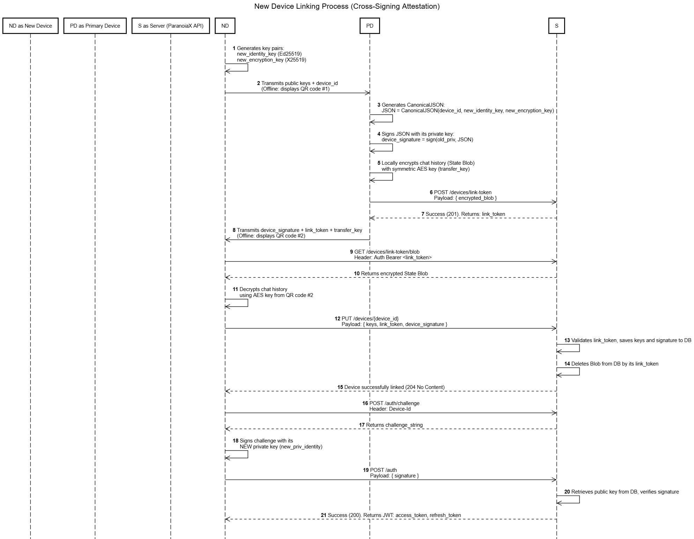

# ParanoiaX: Users

This service is responsible for user lifecycle management, strict authentication, device fleet management, and public key distribution.

Here is the consolidated and structured section for your `README.md`. I have merged the overlapping concepts (like initialization and challenge-response) into a single, cohesive chronological flow, maintaining the professional technical tone and keeping the sequence diagram intact.

---

## 1. Onboarding: Invite-Only Registration & Passwordless Authentication

ParanoiaX does not allow open registration. The system is strictly invite-only (existing participants can invite new members), 
and the architecture completely eliminates passwords. Instead, it relies on strict hardware-backed cryptographic verification.

The primary client application executes a fully localized cryptographic initialization before communicating with the backend.

### The Onboarding Flow

**Phase 1: Invitation & Secure Connection**

1. **Invite Generation:** An existing user generates a one-time temporary registration token via their client application.
2. **QR Code Formation:** The server URL, registration token, and SSL/TLS certificate hash (fingerprint) are embedded into a QR code (or invite link).
3. **MITM Protection:** The new client scans the QR code and verifies the certificate hash during the very first connection. This guarantees protection against Man-in-the-Middle (MITM) attacks by ISPs or corporate networks.

**Phase 2: Local Cryptographic Initialization**

1. **Key Generation:** The new device locally generates **two independent ECC key pairs**:
   - `Identity_Key` (Ed25519) used exclusively for digital signatures and authentication.
   - `Encryption_Key` (X25519) used exclusively for End-to-End Encryption (E2EE) of chat messages.
2. **Device Identification:** A unique `device_id` (UUIDv4) is generated to identify this specific hardware instance.
3. **Hardware Isolation:** The private keys are immediately stored in the OS hardware-backed secure enclave (Keystore on Android / Keychain on iOS/macOS) and **never leave the device** under any circumstances.

**Phase 3: Profile Registration**

1. **Server Upload:** The client transmits the registration token, desired username, public `Identity_Key`, and public `Encryption_Key` to the server to establish the profile.

**Phase 4: Passwordless Authentication (Challenge-Response)**

To prove key ownership and get session JWTs (upon registration, app launch, or session expiration), the client executes a cryptographic handshake:
1. The client requests a random string (Challenge) from the server.
2. The client locally signs this string with its private `Identity_Key` (Ed25519).
3. The server verifies the signature against the stored public key and, if successful, issues a pair of JWTs (Access and Refresh).

### Sequence Diagram

---

## 2. Device Pairing & Cross-Signing Attestation

Since message history is stored on the server and private ECC keys cannot be copied, pairing a new device (e.g., a PC) to an existing account requires a secure State Migration.

More importantly, to protect against **Ghost Device Attacks** (where a compromised server injects a fake device to intercept messages), ParanoiaX implements **Cross-Signing**. 
The server is never trusted to verify device ownership. Instead, the primary device cryptographically signs the new device's public keys.

### 3.1. Cryptographic Key Hierarchy

To maintain Perfect Forward Secrecy and ensure a compromised device does not expose the entire account's history, ParanoiaX strictly separates *trust* from *encryption*:

* **Account Level (Master Identity):** During initial registration, the first device generates a single Master Identity Key Pair (Ed25519). The public key acts as the user's global cryptographic "passport." The Master Private Key is securely stored locally on the primary device and is used *exclusively* to sign and authorize secondary devices.
* **Device Level (Independent Keys):** Every device (including the primary one) generates its own independent Identity Key Pair (for API authentication) and Encryption Key Pair (X25519, for E2EE messages). When a contact sends a message, their client individually encrypts it for each of the recipient's verified devices.

### 3.2. The Migration Protocol

1. **Key Generation:** The new device generates its own independent Ed25519 and X25519 key pairs.
2. **Cross-Signing (Offline):** The primary device scans the new device's keys and signs them using its Master Private Key, generating a `device_signature`.
3. **State Encryption:** The primary device encrypts the local database of symmetric AES chat keys using a randomly generated one-time `transfer_key`.
4. **Server Upload:** The encrypted Blob is uploaded to the server. The server acts as a "dumb pipe" and cannot decrypt it.
5. **Optical Transmission (Offline):** The primary device displays a QR code containing the `link_token`, the `device_signature`, and the `transfer_key`. The AES key never touches the network.
6. **Atomic Registration (2-Phase Commit):** The new device fetches the Blob, decrypts it locally, and submits its keys + signature to the server. The server verifies the token, registers the device, and strictly then deletes the transit Blob.

### Sequence Diagram
