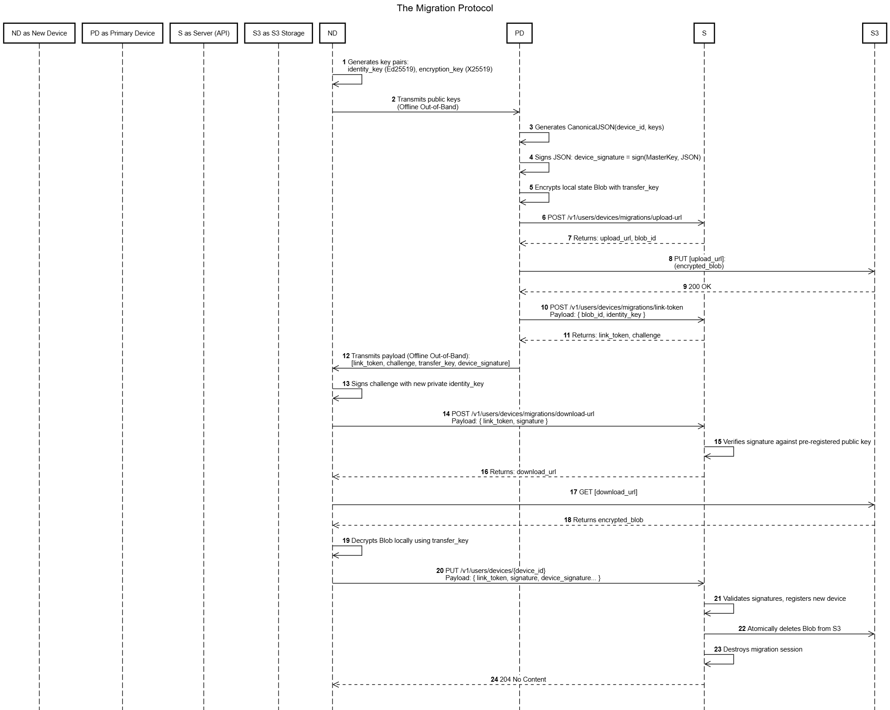

# ParanoiaX: Users

This service is responsible for user lifecycle management, strict authentication, device fleet management, and public key distribution.

---

## 1. Onboarding: Invite-Only Registration & Passwordless Authentication

By default, ParanoiaX operates in a strictly invite-only mode (existing participants can invite new members), though administrators can toggle open registration via system configuration. Regardless of the registration mode, the architecture completely eliminates passwords, relying instead on strict hardware-backed cryptographic verification.

The primary client application executes a fully localized cryptographic initialization before communicating with the backend.

### The Onboarding Flow

**Phase 1: Invitation & Secure Connection**

1. **Invite Generation:** An existing user generates a one-time temporary registration token via their client application.
2. **Payload Formation:** The server URL, registration token, and Subject Public Key Info (spki_pin) are embedded into a payload for out-of-band transmission.
3. **MITM Protection:** The new client reads the payload and verifies the certificate hash during the very first connection. This guarantees protection against Man-in-the-Middle (MITM) attacks by ISPs or corporate networks.

**Phase 2: Local Cryptographic Initialization**

1. **Key Generation:** The new device locally generates **ECC key pairs**:
   - `Master_Identity_Key` (Ed25519): Used exclusively as the root of trust to cross-sign future devices.
   - `Device_Identity_Key` (Ed25519): Used for API authentication (Challenge-Response) and digital signatures.
   - `Device_Encryption_Key` (X25519): Used for ECIES-based key distribution of E2EE chat keys. *(Secondary devices generate only the latter two).*
2. **Device Identification:** A unique `device_id` is generated via CSPRNG (UUIDv4 format) to securely identify this specific hardware instance and prevent ID enumeration.
3. **Hardware Isolation:** The private keys are immediately stored in the OS hardware-backed secure enclave (Keystore on Android / Keychain on iOS/macOS) and **never leave the device** under any circumstances.

**Phase 3: Profile Registration**

1. **Server Upload:** The client transmits the registration token, desired username, public `Identity_Key`, and public `Encryption_Key` to the server to establish the profile.

**Phase 4: Passwordless Authentication (Challenge-Response)**

To prove key ownership and get session JWTs (upon registration, app launch, or session expiration), the client executes a cryptographic handshake:
1. The client requests a random string (Challenge) from the server.
2. The client locally signs this string with its private `Identity_Key` (Ed25519).
3. The server verifies the signature against the stored public key and, if successful, issues a pair of JWTs (Access and Refresh).

### Sequence Diagram

---

## 2. Device Pairing & Cross-Signing Attestation

Since message history is stored on the server and private ECC keys cannot be copied, pairing a new device (e.g., a PC) to an existing account requires a secure State Migration.

More importantly, to protect against **Ghost Device Attacks** (where a compromised server injects a fake device to intercept messages), ParanoiaX implements **Cross-Signing**. 
The server is never trusted to verify device ownership. Instead, the primary device cryptographically signs the new device's public keys.

### 2.1. Cryptographic Key Hierarchy

To maintain Perfect Forward Secrecy and ensure a compromised device does not expose the entire account's history, ParanoiaX strictly separates *trust* from *encryption*:

* **Account Level (Master Identity):** During initial registration, the first device generates a single Master Identity Key Pair (Ed25519). The public key acts as the user's global cryptographic "passport." The Master Private Key is securely stored locally on the primary device and is used *exclusively* to sign and authorize secondary devices.
* **Device Level (Independent Keys):** Every device (including the primary one) generates its own independent Identity Key Pair (for API authentication) and Encryption Key Pair (X25519, for E2EE messages). When a contact sends a message, their client individually encrypts it for each of the recipient's verified devices.

### 2.2. The Migration Protocol

1. **Key Generation:** The new device generates its own independent Ed25519 and X25519 key pairs.
2. **Cross-Signing (Offline):** The primary device scans the new device's keys and signs them using its Master Private Key, generating a `device_signature`.
3. **State Encryption:** The primary device encrypts the local database of symmetric chat keys using a randomly generated one-time `transfer_key`.
4. **Server Upload:** The primary device requests a presigned URL to upload the encrypted Blob directly to an S3 Storage. It then submits the blob reference along with the new device's identity key to the server. The server returns an `link_token` and a one-time `challenge`.
5. **Out-of-Band Transmission (Offline):** The primary device transfers the migration context via a secure out-of-band channel. The payload contains:
   * `link_token`: The session identifier for the server.
   * `challenge`: The server-generated challenge to prevent replay attacks.
   * `transfer_key`: The symmetric key to decrypt the Blob locally (never touches the network).
   * `device_signature`: The Master Key's authorization of the new device.
6. **Server Fetch:** The new device reads the payload, signs the challenge using its private `identity_key`, and requests the Blob. The server verifies the signature.
7. **Registration:** The new device submits the final registration request containing the `link_token`, the signed `challenge`, and the `device_signature`. The server validates the signature, registers the device, and then deletes the migration session and deletes the Blob.

### Sequence Diagram
